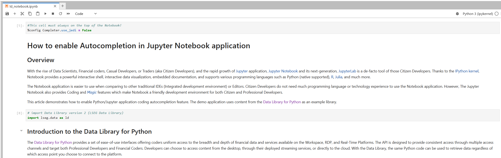
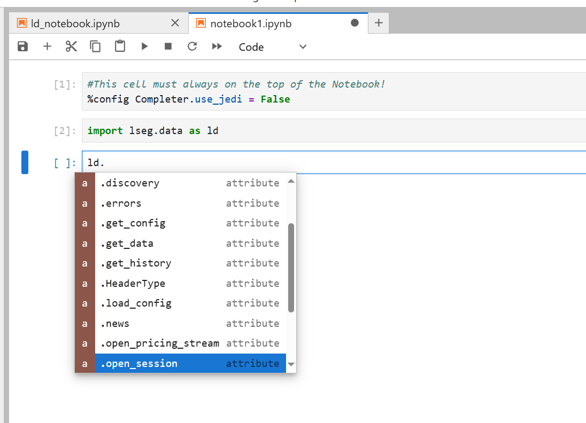
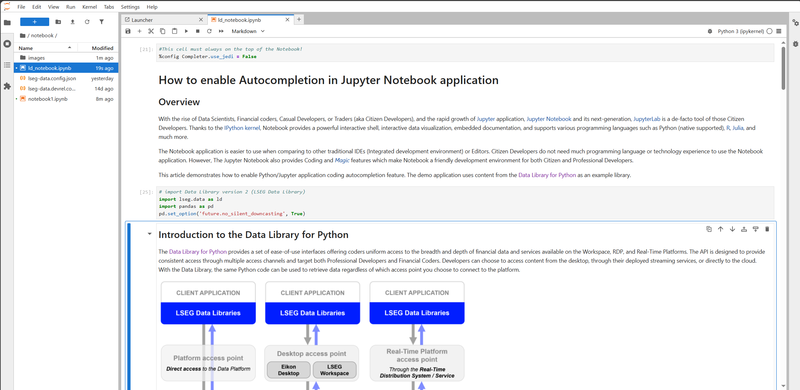

# How to enable Autocompletion in JupyterLab application


## <a id="overview"></a>Overview

**Last Updated**: April 2025

With the rise of Data Scientists, Financial coders, Casual Developers, or Traders (aka Citizen Developers), and the rapid growth of [Jupyter](https://jupyter.org/) application, the [JupyterLab](https://jupyter.org/) (aka Notebook) is a de-facto tool of those Citizen Developers. Thanks to the [IPython kernel](https://ipython.org/), Notebook provides a powerful interactive shell, interactive data visualization, embedded documentation, and supports various programming languages such as Python (native supported), [R](https://developers.refinitiv.com/en/article-catalog/article/setup-jupyter-notebook-r), [Julia](https://datatofish.com/add-julia-to-jupyter/), and much more.

The Notebook application is easier to use when comparing to other traditional IDEs (Integrated development environment) or Editors. Citizen Developers do not need much programming language or technology experience to use the Notebook application. However, The Jupyter Notebook also provides Coding and [*Magic*](https://ipython.readthedocs.io/en/stable/interactive/magics.html) features which make Notebook a friendly development environment for both Citizen and Professional Developers.

This article demonstrates how to enable Python/Jupyter application coding autocompletion feature. The demo application uses content from the [Data Library for Python](https://developers.lseg.com/en/api-catalog/lseg-data-platform/lseg-data-library-for-python) as an example library.

## <a id="data_lib"></a>Introduction to the Data Library for Python

The [Data Library for Python](https://developers.lseg.com/en/api-catalog/lseg-data-platform/lseg-data-library-for-python) provides a set of ease-of-use interfaces offering coders uniform access to the breadth and depth of financial data and services available on the Workspace, Data Platform, and Real-Time Platforms. The API is designed to provide consistent access through multiple access channels and target both Professional Developers and Financial Coders. Developers can choose to access content from the desktop, through their deployed streaming services, or directly to the cloud. With the Data Library, the same Python code can be used to retrieve data regardless of which access point you choose to connect to the platform.

 

The Data Library are available in the following programming languages:

- [Python](https://developers.lseg.com/en/api-catalog/lseg-data-platform/lseg-data-library-for-python)
- [.NET](https://developers.lseg.com/en/api-catalog/lseg-data-platform/lseg-data-library-for-net)
- [TypeScript](https://developers.lseg.com/en/api-catalog/refinitiv-data-platform/refinitiv-data-library-for-typescript)

For more deep detail regarding the Data Library for Python, please refer to the following articles and tutorials:

- [Quickstart](https://developers.lseg.com/en/api-catalog/lseg-data-platform/lseg-data-library-for-python/quick-start).
- [Documentation](https://developers.lseg.com/en/api-catalog/lseg-data-platform/lseg-data-library-for-python/documentation).
- [Tutorials](https://developers.lseg.com/en/api-catalog/lseg-data-platform/lseg-data-library-for-python/tutorials).
- [GitHub](https://github.com/LSEG-API-Samples/Example.DataLibrary.Python).

### Disclaimer

This article is based on Data Library Python versions **2.1.1**

## <a id="python-built-in"></a>Python built-in help

The Python programming language comes with a built-in [help() function](https://docs.python.org/3/library/functions.html#help) to display documentation of modules, functions, classes, objects, etc with the following syntax:

```
help([object])
```

However, the result is not always easy to read as the following examples:

 

or

 

For the library that keeps involving like Data Library for Python, this is inconvenient even the Library itself is easy to use. 

## <a id="autocompletion"></a>IPython Autocompletion

Fortunately, the JupyterLab comes with the [IPython magic command](https://ipython.readthedocs.io/en/stable/interactive/magics.html#magic-config) ```%config Completer.use_jedi = False``` statement that enables the library/function autocompletion (like *IntelliSense* in Microsoft development environment term).

You need to set the magic command ```%config Completer.use_jedi = False``` statement at the **top cell** of the Notebook application (like this Notebook). 

 

Once you have enabled and run the ```%config Completer.use_jedi = False``` magic command, you can trigger the code autocompletion by pressing the ```tab``` button after the ```"."``` character.

 

This IPython command also enables the ```"shift + tab"``` buttons to show the function help and tooltip information.

 

You can also use "?" at the end of the function (without ```()```) to display documentation for objects and methods in the IPython environment.

 

Please see the full detail of IPython Autocompletion features with Data Library example in the [tutorial notebook](./notebook/ld_notebook.ipynb).

## <a id="prerequisite"></a>Prerequisite

This example requires the following dependencies software.

1. LSEG Workspace desktop application with access to Data Library for Python.
2. [Python](https://www.python.org/) ([Ananconda](https://www.anaconda.com/distribution/) or [MiniConda](https://docs.conda.io/en/latest/miniconda.html) distribution/package manager also compatible).
3. [Jupyter Lab](https://jupyter.org/) application.

*Note:* 
- This Project has been qualified with Python version 3.11.5
- If you are not familiar with Jupyter Lab application, the following [tutorial](https://www.datacamp.com/tutorial/tutorial-jupyter-notebook) created by DataCamp may help you.

Please contact your LSEG's representative to help you to access the Workspace platform.  

## <a id="application_files"></a>Project Application Files

This example project contains the following files and folders
1. *notebook_python/ld_notebook.ipynb*: The example Jupyter Notebook application file.
2. *requirements.txt*: The project Python dependencies configuration file.
3. *images*: Project images folder.
4. *LICENSE.md*: Project's license file.
5. *README.md*: Project's README file.

## <a id="running"></a>Running the example Notebook.
1. Open a Command Prompt and go to the project's folder
2. Run the following command in a Command Prompt to create a Python virtual environment named *ld_notebook* for the project.
    ```bash
    $>python -m venv ld_notebook
    ```
3. Once the environment is created, activate an environment named ```ld_notebook``` with this command.
    ```bash
    $>ld_notebook\Scripts\activate
    ```
4. Run the following command to install Data Library for Python and all dependencies in *ld_notebook* environment
    ```bash
    (ld_notebook) $>pip install -r requirements.txt
    ```
45. Go to project's notebook folder and update a contain in ```lseg-data.config.json``` file with the your App-Key

    ```json
    {
        "logs": {
            "level": "debug",
            "transports": {
                "console": {
                    "enabled": false
                },
                "file": {
                    "enabled": false,
                    "name": "lseg-data-lib.log"
                }
            }
        },
        "sessions": {
            "default": "desktop.workspace",
            "desktop": {
                "workspace": {
                    "app-key": "YOUR APP KEY GOES HERE!"
                }
            }
        }
    }
    ```

6. In the current Command Prompt, go to project's notebook folder. Run the following command to start Jupyter Lab in the notebook folder.

    ```bash
    $>(ld_notebook)>notebook>jupyter lab
    ```
7. JupyterLab will open the web browser and open the notebook home page.
8. Open *ld_notebook.ipynb* Notebook document, then follow through each notebook cell.

     

## <a id="nextsteps"></a>Conclusion and Next Step

Some Professional Developers may think Jupyter Notebook (and JupyterLab) is just a learning tool for Casual Developers like Data Scientists. However, the tool provides enough coding/development features for a wide range of Developers. The IPython Code Autocompletion feature (and other Magics) helps developers implement the code logic and navigate through the libraries/APIs in the same experience as the traditional IDEs. 

There is some new development project that tries to merge the benefits/features of the traditional IDEs and Jupyter Notebook like [Netflix's Polynote](https://polynote.org/). While the JupyterLab also keeps evolving to make a better development environment and easier to use.

At the same time, the [Data Library for Python](https://developers.lseg.com/en/api-catalog/lseg-data-platform/lseg-data-library-for-python) lets developers rapidly access LSEG content from various platforms with a few lines of code that easy to understand and maintain. Developers can focus on implement the business logic or analysis data without worry about the connection, authentication detail with the Platforms.

## <a id="references"></a>References

You can find more details regarding the Data Library and Jupyter Notebook from the following resources:

- [LSEG Data Library for Python](https://developers.lseg.com/en/api-catalog/lseg-data-platform/lseg-data-library-for-python) on the [LSEG Developer Community](https://developers.lseg.com/) website.
- [Data Library for Python - Reference Guide](https://developers.lseg.com/en/api-catalog/lseg-data-platform/lseg-data-library-for-python/documentation#reference-guide)
- [The Data Library for Python  - Quick Reference Guide (Access layer)](https://developers.lseg.com/en/article-catalog/article/the-data-library-for-python-quick-reference-guide-access-layer) article.
- [Essential Guide to the Data Libraries - Generations of Python library (EDAPI, RDP, RD, LD)](https://developers.lseg.com/en/article-catalog/article/essential-guide-to-the-data-libraries) article.
- [Data Library for Python Examples on GitHub](https://github.com/LSEG-API-Samples/Example.DataLibrary.Python) repository.
- [Jupyter Project Official page](https://jupyter.org/).
- [Jupyter Notebook Shortcuts](https://towardsdatascience.com/jypyter-notebook-shortcuts-bf0101a98330).
- [IPython Built-in magic commands](https://ipython.readthedocs.io/en/stable/interactive/magics.html).
- [Jupyter Notebook: An Introduction](https://realpython.com/jupyter-notebook-introduction/).
- [Jupyter Lab: Evolution of the Jupyter Notebook](https://towardsdatascience.com/jupyter-lab-evolution-of-the-jupyter-notebook-5297cacde6b).
- [10 Compelling Reasons you Should Use JupyterLab for Data Science Coding](https://www.analyticsvidhya.com/blog/2020/06/10-powerful-reasons-jupyterlab-data-science/).

For any questions related to this article or Data Library, please use the Developers Community [Q&A Forum](https://community.developers.refinitiv.com).