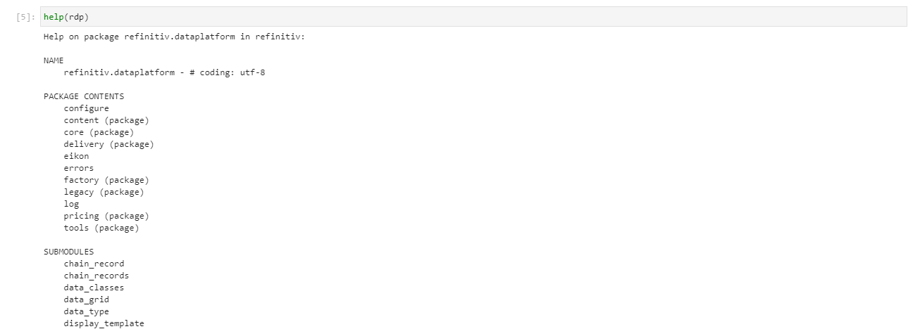
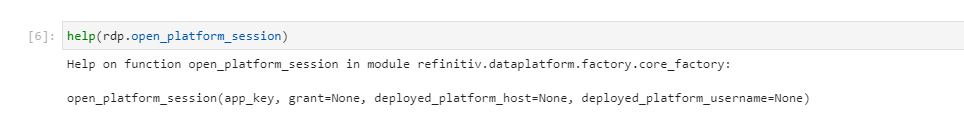
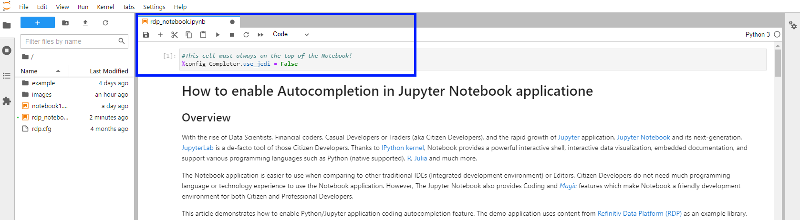
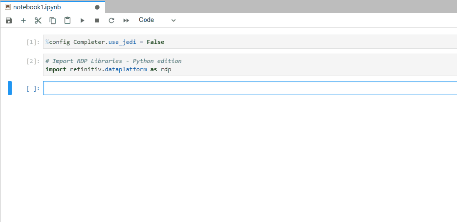
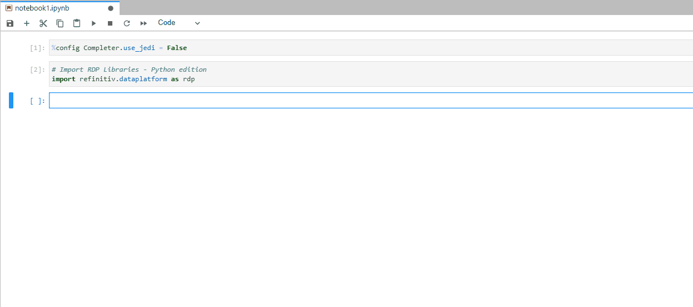
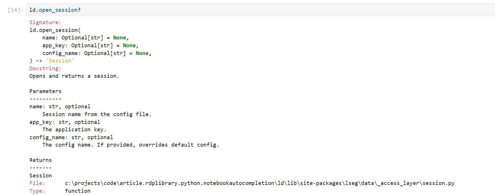
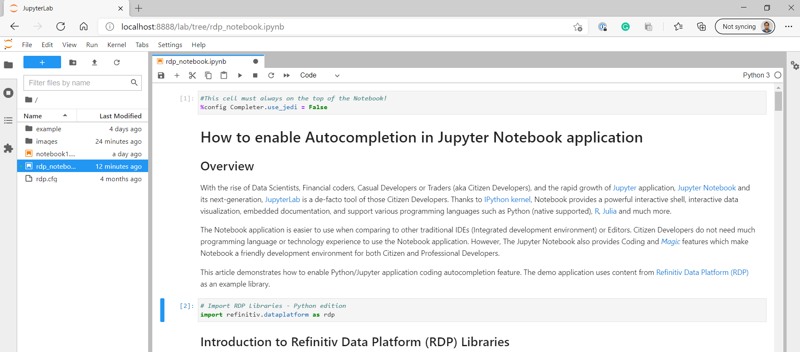

# How to enable Autocompletion in Jupyter Notebook application

## <a id="overview"></a>Overview

With the rise of Data Scientists, Financial coders, Casual Developers, or Traders (aka Citizen Developers), and the rapid growth of [Jupyter](https://jupyter.org/) application, [Jupyter Notebook](https://jupyter-notebook.readthedocs.io/en/stable/) and its next-generation, [JupyterLab](https://jupyterlab.readthedocs.io/en/latest/getting_started/overview.html) is a de-facto tool of those Citizen Developers. Thanks to the [IPython kernel](https://ipython.org/), Notebook provides a powerful interactive shell, interactive data visualization, embedded documentation, and supports various programming languages such as Python (native supported), [R](https://developers.refinitiv.com/en/article-catalog/article/setup-jupyter-notebook-r), [Julia](https://datatofish.com/add-julia-to-jupyter/), and much more. 

The Notebook application is easier to use when comparing to other traditional IDEs (Integrated development environment) or Editors. Citizen Developers do not need much programming language or technology experience to use the Notebook application. However, The Jupyter Notebook also provides Coding and [*Magic*](https://ipython.readthedocs.io/en/stable/interactive/magics.html) features which make Notebook a friendly development environment for both Citizen and Professional Developers.

This article demonstrates how to enable Python/Jupyter application coding autocompletion feature. The demo application uses content from the [Refinitiv Data Platform (RDP)](https://developers.refinitiv.com/refinitiv-data-platform/refinitiv-data-platform-apis) as an example library.

## <a id="rdp_introduction"></a>Introduction to Refinitiv Data Platform (RDP) Libraries

Refinitiv provides a wide range of contents and data which require multiple technologies, delivery mechanisms, data formats, and the multiple APIs to access each content. The [RDP Libraries](https://developers.refinitiv.com/en/api-catalog/refinitiv-data-platform/refinitiv-data-platform-libraries) are a suite of ease-of-use interfaces providing unified access to streaming and non-streaming data services offered within the [Refinitiv Data Platform (RDP)](https://developers.refinitiv.com/en/api-catalog/refinitiv-data-platform/refinitiv-data-platform-apis). The Libraries simplified how to access data to various delivery modes such as Request-Response, Streaming, Bulk File, and Queues via a single library. 

Depending on the level of service and data requirements, developers can easily choose how to access data services using the appropriate access channel defined within the library.

 

Using the library developers can access content from all 3 of the access points - all from within the same application if required. The RDP Libraries are available in the following programming languages:
- Refinitiv Supported Editions: Python and TypeScript/JavaScript (coming soon)
- Community-based Edition: C#

For more deep detail regarding the RDP Libraries, please refer to the following articles and tutorials:
- [Developer Article: Discover our Refinitiv Data Platform Library part 1](https://developers.refinitiv.com/en/article-catalog/article/discover-our-refinitiv-data-platform-library-part-1).
- [Developer Article: Discover our Refinitiv Data Platform Library part 2](https://developers.refinitiv.com/en/article-catalog/article/discover-our-refinitiv-data-platform-library-part-2).
- [Refinitiv Data Platform Libraries Document: An Introduction page](https://developers.refinitiv.com/en/api-catalog/refinitiv-data-platform/refinitiv-data-platform-libraries/documentation#refinitiv-data-platform-libraries-an-introduction).

### Disclaimer

As this notebook is based on alpha version **1.0.0a7.post7** of the Python library, the method signatures, data formats, etc. are subject to change.

## <a id="python-built-in"></a>Python built-in help

The Python programming language comes with a built-in [help() function](https://docs.python.org/3/library/functions.html#help) to display documentation of modules, functions, classes, objects, etc with the following syntax:

```
help([object])
```

However, the result is not always easy to read as the following examples:

 

or

 

For the library that keeps involving like RDP Libraries, this is inconvenient even the RDP Library itself is easy to use. 

## <a id="autocompletion"></a>IPython Autocompletion

Fortunately, the JupyterLab and Jupyter Notebook comes with the [IPython magic command](https://ipython.readthedocs.io/en/stable/interactive/magics.html#magic-config) ```%config Completer.use_jedi = False``` that enables the library/function autocompletion (like *IntelliSense* in Microsoft development environment term).

You need to set the magic command ```%config Completer.use_jedi = False``` at the **top cell** of the Notebook application (like this Notebook). 

 

Once you have enabled and run the ```%config Completer.use_jedi = False``` magic command, you can trigger the code autocompletion by pressing the ```tab``` button after the ```"."``` character.

 

Let's try it yourself, please select the space just after the ```"."``` character below and hit the ```tab``` button.

This IPython command also enables the ```"shift + tab"``` buttons to show the function help and tooltip information.

 

You can also use "?" at the end of the function (without ```()```) to display documentation for objects and methods in the IPython environment.

 

Please see the full detail of IPython Autocompletion features with RDP Libraries example in the [tutorial notebook](./notebook/rdp_notebook.ipynb).

## <a id="prerequisite"></a>Prerequisite
This demo project requires the following dependencies software.
1. RDP Access credentials.
2. [Refinitiv Data Platform Library for Python](https://pypi.org/project/refinitiv-dataplatform/).
2. Python [Anaconda](https://www.anaconda.com/distribution/) or [MiniConda](https://docs.conda.io/en/latest/miniconda.html) distribution/package manager.
3. [Jupyter Notebook or JupyterLab](https://jupyter.org/).
4. Internet connection.

Please contact your Refinitiv's representative to help you to access Refinitiv Data Platform credentials. You can generate/manage the AppKey from the  [AppKeyGenerator website](https://emea1.apps.cp.thomsonreuters.com/apps/AppkeyGenerator) or AppKey Generator tool in Eikon Desktop/Refinitiv Workspace application. 

## <a id="application_files"></a>Project Application Files
This example project contains the following files and folders
1. *notebook_python/rdp_notebook.ipynb*: The example Jupyter Notebook application file.
2. *requirements.txt*: The project Python dependencies configuration file.
3. *images*: Project images folder.
4. *LICENSE.md*: Project's license file.
5. *README.md*: Project's README file.

## <a id="running"></a>Running the example Notebook.
1. Open Anaconda Prompt and go to the project's folder
2. Run the following command in a Anaconda Prompt to create a Conda environment named *RDP_Notebook* for the project.
    ```
    (base) $>conda create --name RDP_Notebook python=3.7
    ```
3. Once the environment is created, activate Conda environment named ```RDP_Notebook``` with this command in Anaconda Prompt
    ```
    (base) $>conda activate RDP_Notebook
    ```
4. Run the following command to install RDP Library for Python and all dependencies in *RDP_Notebook* environment
    ```
    (RDP_Notebook) $>pip install -r requirements.txt
    ```
5. Go to the project's *notebook folder* and create a file name ```rdp.cfg``` with the following content
    ```
    [rdp]
    username = YOUR_RDP_USERNAME
    password = YOUR_RDP_PASSWORD
    app_key = YOUR_RDP_APP_KEY
    ```

    Please note that you *do not* need the ```""``` or ```''``` characters for a string value as the following example:

    ```
    [rdp]
    username=example@email.com
    password=$$example_password%%
    app_key=bbb_example_client_id_ccc
    ```

6. In the current Anaconda Prompt, go to the project's notebook folder. Run the following command to start JupyterLab application in the notebook folder.
    ```
    (RDP_Notebook) $>notebook>jupyter-lab
    ```
7. JupyterLab will open the web browser and open the notebook home page.
8. Open *rdp_notebook.ipynb* Notebook document, then follow through each notebook cell.

     

## <a id="nextsteps"></a>Conclusion and Next Step

Some Professional Developers may think Jupyter Notebook (and JupyterLab) is just a learning tool for Casual Developers like Data Scientists. However, the tool provides enough coding/development features for a wide range of Developers. The IPython Code Autocompletion feature (and other Magics) helps developers implement the code logic and navigate through the libraries/APIs in the same experience as the traditional IDEs. 

There is some new development project that tries to merge the benefits/features of the traditional IDEs and Jupyter Notebook like [Netflix's Polynote](https://polynote.org/). While the JupyterLab also keeps evolving to make a better development environment and easier to use.

At the same time, the [Refinitiv Data Platform (RDP) Libraries](https://developers.refinitiv.com/refinitiv-data-platform/refinitiv-data-platform-libraries) let developers rapidly access Refinitiv Platform content with a few lines of code that easy to understand and maintain. Developers can focus on implement the business logic or analysis data without worry about the connection, authentication detail with the Refinitiv Platforms.

## <a id="references"></a>References

You can find more details regarding the Refinitiv Data Platform Libraries and Jupyter Notebook from the following resources:
* [Refinitiv Data Platform (RDP) Libraries](https://developers.refinitiv.com/en/api-catalog/refinitiv-data-platform/refinitiv-data-platform-libraries) on the [Refinitiv Developer Community](https://developers.refinitiv.com/) web site.
* [Jupyter Project Official page](https://jupyter.org/).
* [Jupyter Notebook Shortcuts](https://towardsdatascience.com/jypyter-notebook-shortcuts-bf0101a98330).
* [IPython Built-in magic commands](https://ipython.readthedocs.io/en/stable/interactive/magics.html).
* [Jupyter Notebook: An Introduction](https://realpython.com/jupyter-notebook-introduction/).
* [Jupyter Lab: Evolution of the Jupyter Notebook](https://towardsdatascience.com/jupyter-lab-evolution-of-the-jupyter-notebook-5297cacde6b).
* [10 Compelling Reasons you Should Use JupyterLab for Data Science Coding](https://www.analyticsvidhya.com/blog/2020/06/10-powerful-reasons-jupyterlab-data-science/).
* [RDP Libraries Quick Start Guide page](https://developers.refinitiv.com/en/api-catalog/refinitiv-data-platform/refinitiv-data-platform-libraries/quick-start).
* [RDP Libraries Tutorial page](https://developers.refinitiv.com/en/api-catalog/refinitiv-data-platform/refinitiv-data-platform-libraries/tutorials).
* [Discover our Refinitiv Data Platform Library (part 1)](https://developers.refinitiv.com/en/article-catalog/article/discover-our-refinitiv-data-platform-library-part-1).
* [Discover our Refinitiv Data Platform Library (part 2)](https://developers.refinitiv.com/en/article-catalog/article/discover-our-refinitiv-data-platform-library-part-2).
* [Use Eikon Data API or RDP Library in Python in CodeBook on Web Browser article](https://developers.refinitiv.com/en/article-catalog/article/use-eikon-data-api-or-rdp-library-python-codebook-web-browser)

For any questions related to this article or Refinitiv Data Platform Libraries, please use the Developers Community [Q&A Forum](https://community.developers.refinitiv.com/spaces/321/refinitiv-data-platform-libraries.html).